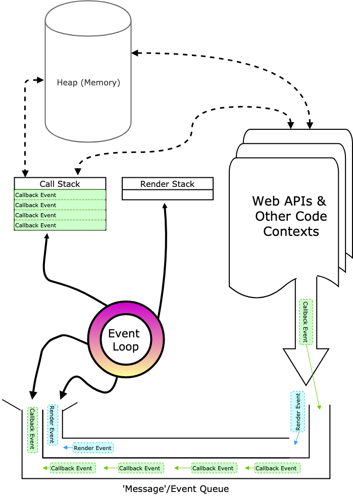

# The Javascript Event Loop

## Table Of Contents
1. [The Single Threaded Nature of Javascript](#The-Single-Threaded-Nature-of-Javascript)
2. [What's an Event Loop Anyways](#whats-an-event-loop-anyways)
3. [Blocking The Event Loop](#blocking-the-event-loop)
    1. [Gotchas In The Node Event Loop](#Gotchas-In-The-Node-Event-Loop)
4. [Sources](#sources)
 

## The Single Threaded Nature of Javascript

Javascript is single threaded by default. Truth be told it's notq uite this simple, but as a starting place for understanding how the event loop actually works, it's a good assumption to start with.

Single threaded code is executed one part at a time. Spawning new threads to spread computational costs over multiple CPU-cores is still somewhat non-trivial at this point in the game. I say somewhat because it is absolutely possible, but for right now, this discussion will be limited to V8's core functionality.

The rationale is actually pretty straightforward - perforance and security. If you would like to write javascript that performs sluggishly and is vulnerable to attacks, then please stop reading this now and just pretend like you never heard of an event loop. But your code isn't sluggish your say? Well sure, but that will be true until it isn't. Just because you haven't fallen off a bicyle doesn't mean you shouldn't wear a helmet.

## Whats An Event Loop Anyways

## Blocking The Event Loop

When the Event Loop can is taking too long to execute some callback, the entire main thread will sit there uselessly, like an unwanted house guest. It will not be able to continue it's job of queueing more callbacks for execution.

So where do these callbacks come from you ask? Great question. If we are talking about a Node/server-side situation, these callbacks are being initiated by client requests and the code associated with the application endpoints. This code is primarily executed within the 'main thread', with exceptions being

Writing code that blocks the is actually super easy to do. Blockage as a phrase in this context refers to what happens when the V8 main thread can not process items on its to-do list (metaphorically speaking) because it is waiting for code in its call stack (not metaphorical at all) to finish executing. Event loop blocking, as it's commonly referred to as, can happen server side or client-side. Either way it can cause all sorts of mayhem including slow http responses, timeouts, frozen animations, unresponsive UI elements, delayed screen renderings, and plenty more.

## Event Loops in Node vs. Browsers

### Gotchas In The Node Event Loop

Node uses the fastest, best Javascript Engine of all time, the Google V8 engine. It's damn fast, with a few small exceptions:

1. JSON Operations
2. Regular Expressions

Depending on the size and complexity of the the function calls containing the 'dangerous' operation types listed above, your event loop could definitely be slower than expected. Keeping your JSON operations and regular expressions as succinct as possible can have a definite impact on your Event Loop's speed and efficiency. 

### Blockage Example

Consider the code example below, which is left intentionally synchronous - meaning that the function calls happen in order, and in a one at a time fashion. You will notice that as the main thread waits for the result to be calculated, the main thread is not able to move on, causing event loop stagnation.

```js
/* line 1 */ const result1 = calculateNthPrime(5000000);
/* line 2 */ console.log('the five millionth prime number is: ', result1);
/* line 3 */ const result2 = calculateNthPrime(20);
/* line 4 */ console.log('the twentieth prime number is: ', result2);
/* line 5 */ const result3 = calculateNthPrime(3);
/* line 6 */ console.log('the third prime number is: ', result3);
```

This chunk of code is not terribly complicated but making it from `line 1` to `line 2` will require some intense CPU resources. As primes get bigger, they get harder and harder to find, because there is more space between them. As a result of the single threaded nature of JS, this code will take a while, and then spit out all the results really quickly.

By understanding how the V8 works, we can pretty quickly come up with some work arounds for this kind of situation, to make sure one tricky method doesn't completely destroy the end user experience. More on that later though. Lets begin this by looking at the mechanisms and structures used by the V8 engine.

&nbsp;

## JS Runtime Structures, Mechanisms, and Concepts

### Heap

Lets not worry too much aboute this one. For the sake of this discussion, the heap can be thought of as where memory is allocation happens within for the JS Runtime.

### Call Stack

Since javascript is single threaded, the functions executed within the main thread are necessarily executed right from the call stack. As the main execution thread steps 'into' a function, the function is added to the stack. As main execution thread returns from a function, that function is popped off of the stack. 

#### A Call Stack Example

Consider the following code living within hypothetical file: _`main.js`_.

```javascript
// main.js

function multiply(a, b) {
  return a * b;
}

function square(n) {
  return multiply(n, n);
}

function printSquare(n) {
  var squared = square(n);
  console.log(squared);
}

printSquare(4);
```

1. As the main execution thread steps into the _`main.js`_ file. The first thing that happens is that _`main`_ is added to the call stack.

    | Call Stack |
    |:-----------|
    | `main()`   | 

2. As soon as printSquare is called, the pretty much immediately needs to step into the function _`printSquare`_, causing that function context to also be pushed onto the stack. Since the thread has not technically returned from _`main`_, that function context is left on the stack, just below _`printSquare`_.

    | Call Stack |
    |:-----------|
    | `printSquare(4)` |  
    | `main()` |

3. As the various methods within _`main.js`_ are 'stepped into', the call stack quickly looks something like the following:

    | Call Stack           |
    |:---------------------|
    | `multiply(n, n)`     |  
    | `square(n)`          |  
    | `printSquare(4)`     |
    | `main()`             |

4. As functions are called, if they return other functions, the 'other' functions are popped off the stack. For example, as soon as the _`multiply`_ function completes, and the thread returns from that context back to the _`square`_ function, the stack pops off the _`multiply`_ context from the stack, causing it to look something like this:

    | Call Stack           |
    |:---------------------|
    | `square(n)`          |
    | `printSquare(4)`     |
    | `main()`             |

5. As the thread of execution returns to _`printSquare`_, a _`console.log`_ method needs to be added to the stack.

    | Call Stack              |
    |:------------------------|
    | `console.log(squared)`  |
    | `printSquare(4)`        |
    | `main()`                |

6. As execution of _`printSquare`_ continues, although there is no 'return', the return is implicit. The lack of more lines of code to execute causes the implicit return. Same is true for the _`main()`_ function-file-context. As the rest of the file is executed the call stack goes through the following evolutions before the event loop is free to check the task and render queues.

    | Call Stack              |
    |-------------------------|
    | `printSquare(4)`        |
    | `main()`                |
    &nbsp; 

    | Call Stack              |
    |:------------------------|
    | `main()`                |
    &nbsp; 

    | Call Stack |
    |:-----------|
    | _(empty)_  |
    &nbsp; 

Analyzing the callstack carefully lets us know exactly where we are in the program. Ergo, this mechanism is what is used when generating the call stack traces that you might have seen once or twice. Technically, the things passed onto the stack are execution contexts. Sometimes these contexts are referred to as execution frames.

The call stack is related to why people mistakenly think that the js runtime only uses one thread. We will learn why this isn't exactly the truth later on, but for now, think of it this way:

```
one thread == one call stack == one thing happens at once

source: https://www.youtube.com/watch?v=8aGhZQkoFbQ#action=share
```

### Web APIs 

These are simply functions and execution constexts provided by the browser iself - not the V8 engine. Another way to think of these would be as code that doesn't live inside the V8 engine or within the application currently being executed. Web APIs perform actions and even provide for the DOM structure itself. Web APIs have the ability to spawn their own tasks that can execute outside of the main thread's execution loop. These APIs are the reason the V8 doesn't need to worry about handling the DOM and can therefore be run with no web browser what-so-ever. Some commononly used Web API examples are listed below.

- DOM (document object model and related functions/properties)
- AJAX / XMLHttpRequest
- setTimeout()
- setInterval()

Although these Web API methods aren't technically _part_ of the event loop, they do interact with it, albeit somewhat indirectly. In order to understand this, we need to explore a few other structures hanging around in our JS runtime.

### The Callback-Task-Render-Message Queue

This is where/how functions and events are scheduled for execution. Items can be pushed onto the callstack through functions being executed and/or WebAPIs, and/or other mechanisms. 

The setTimeout method provides for a decent example here. When a setTimeout function's timer mechanism completes, the webAPI queues the callback function onto the task queue. Unlike the call stack, it's important to remember this really is a queue and not a stack. If other callbacks were already there, they will get be pushed onto the call stack first. This means that setting the timeout to `0` doesn't actually give the callback any preferential treatment within the task queue. It does cause the callback to be queued without having to wait for a timer to go off. As far as the callstack is concerned though, as soon as the 'timer' begins, the main thread has already popped the `setTimeout` off the stack.

Importantly, the event loop is not going to check the task queue until all the current elements within the call stack have been popped. That's right, the call stack needs to be entirely emptied before the event loop will check for more tasks within the callback/task queue.

### Render Queue

Browsers want to re-paint the screen extremely quickly, as this makes for the best possible user experience. But somewhat problematically, the browser's ability to render and re-render the screen can be directly blocked by the call stack not being 'finished' or 'emptied' yet.

Somewhat strangely, the render queue is somewhat separate from the callback queue, and is also prioritized over the callback queue.

Every 16 milliseconds, a 'render' action is added to the render queue, and the event loop will always prioritize these tasks over tasks within the callback queue.

While the render queue waits for the call stack to complete, the screen will appear 'stuck' for the user. Buttons don't click, videos don't play, animations don't animate, etc. 

### The Actual Event Loop

The actual event loop is simply the mechamism that pulls items ('messages') out of the event and render queues and pushes and onto the callstack. The event loop waits for the call stack to complete it's executing and popping/pushing functions. As soon as this process is complete, the event loop grabs tasks/events from task/event queues and pushes these items onto the call stack.

This is what the event loop part of the JS Runtime actually is. It's the thing that grabs execution contexts from queues and pushes them onto the call stack. This is why when one engineer says 'looks like the main thread is blocked' and another engineer says 'looks like the event loop is totally blocked', they can both be totally right. Or totally wrong. You get the idea though. 

### Can Two Runtimes Work Together?

Yes. Two distinct runtimes can communicate through sending messages via the postMessage method. This method adds a message to the other runtime if the latter listens to message events.

## FAQs

- How does one monitor the Event Loop. Are there ways to write tests to ensure your application reflects all of this great knowledge you've just acquired?
    - [Ummmm... well... sort of](https://medium.com/the-node-js-collection/what-you-should-know-to-really-understand-the-node-js-event-loop-and-its-metrics-c4907b19da4c#8a87)
    - [If that link didn't use this one and look for the 'monitoring the event loop' section](https://medium.com/the-node-js-collection/what-you-should-know-to-really-understand-the-node-js-event-loop-and-its-metrics-c4907b19da4c)

## Work Arounds

### 1) Web Workers

It is technically possible to run two V8 engines within the same allocated process by using web workers. Importantly, these two main-loop 'threads' won't share memory, or variables. While making conconcurency management easier, this can make sharing resources a little tricky if dependencies exist between the two threads. 

### 2) Thread Pool Experimental API

### 3) Just Divide and Conquer

### The Main Thread Visualized




&nbsp;

### Asynchronous Callbacks

### Concurrency & The Event Loop

One thing at a time. Except when more happens. WebAPIs are kind of like separate threads.

## Blocking

Sometimes things on the call stack are slow. Blocking is whats happening. 

## Glossary of Fancy Words for Newbs and Lazies

| Phrase | Definition |
| -------|------------|
| V8 Engine |  An open source Javascript engine which is used by Chrome, and is also used to execute JS code in Node environments. Built by Google, it is open source and written in C++. |
| Runtime | Sometimes referred to as the 'main thread' - this is the parent process utilized used by the V8 engine.|
| synchronous code | happens sequentially, one thing at a time |


--- 
## Sources

- [Javascript event loop youtube video](https://www.youtube.com/watch?v=XzXIMZMN9k4)
- [Web Workers API Docs on Mozilla](https://developer.mozilla.org/en-US/docs/Web/API/Web_Workers_API)
- [Javascript V8 Engine Hackernoon Article](https://hackernoon.com/javascript-v8-engine-explained-3f940148d4ef)
- [Mozilla's docs on Web APIs](https://developer.mozilla.org/en-US/docs/Web/API)
- [The Node Event Loop Explained](https://nodejs.org/en/docs/guides/event-loop-timers-and-nexttick/#what-is-the-event-loop)
- [The Node Event Loop From Inside Out](https://www.youtube.com/watch?v=P9csgxBgaZ8)
- [The Node.js Event Loop: Not So Single Threaded](https://www.youtube.com/watch?v=zphcsoSJMvM)
- [Philip Roberts' Vimeo Help I'm Stuck In An Event Loop](https://vimeo.com/96425312)
- [A Complete Guide to the Node.js Event Loop](https://blog.logrocket.com/a-complete-guide-to-the-node-js-event-loop/)
- [The Node Event Loop](https://medium.com/the-node-js-collection/what-you-should-know-to-really-understand-the-node-js-event-loop-and-its-metrics-c4907b19da4c)
- [Web Workers Section From You Don't Know JS](https://github.com/getify/You-Dont-Know-JS/blob/master/async%20%26%20performance/ch5.md#web-workers)
