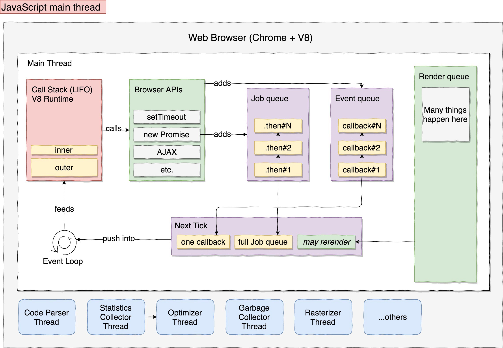

# The Javascript Event Loop: What Every Javascript Developer Needs To Know

## The Single Threaded Nature of Javascript

Javascript is single threaded by default. Truth be told it's not quite this simple, but as a starting place for understanding how the event loop actually works, it's a good assumption to start with.

&nbsp;

### What Does Single Threaded Mean?

It means that code is executed one part at a time. By default, the Javascript V8 Engine [V8] does not break code into separate chunks that can be executed in paralel. Because of this it's not possible to spawn new threads to spread your computation costs over multiple CPU-cores for true parallel work. Another important consequence of this is that you could unintentionally block the main thread, which is quite uncool in almost every circumstance. This type of blockage can cause delays and timeouts to happen when it happens server side and can cause all sorts of mayhem, i.e. sluggish/frozen ui responses, frozen animations, etc., when it happens within a client browser.

Consider the code example below, which is NOT WRITTEN asynchronously. You will notice that as the main thread waits for the result to be calculated, the main thread is not able to move on, causing event loop stagnation.

```js
/* line 1 */ const result = calculateNthPrime(5000000)
/* line 2 */ renderTheStuff(result.isPrime || null);
```

&nbsp;

## Javascript Execution

### Call Stack 

As functions are called, they are put on the main thread's call stack. As functions are executed they are popped off the stack. This mechanism is what is used when generating the call stack traces that you might have seen once or twice.

### Event/Message Queue

This is queue can be thought of as a list of messages to be processed. Each message has an associated function which gets called as the message is 'handled' by the V8 Runtime. Messages are 'scheduled' in that the queue maintains their order such that the oldest items are de-queued/processed first. Processing each message involves calling their functions, with the actual messages supplied as input parameters. As each 'message' object from this queue is processed its corresponding function-call causes a new stack-frame for that function's use. The processing of functions then continues until the entire call-stack is empty, at which point the event loop will move on to the next 'message-event-object' within the queue. Ergo, this mechanims where/how functions and events are scheduled for execution.

#### Who is Adding These Messages You Ask?

This depends a little on where the code is being executed. Within a web browser for instance, messages can be added anytime an event occurs and there is an event listener attached.

### Heap

Large, mostly instructured area of memory used by the Javascript Runtime.

### Web APIs 

These are functions provided by the browser iself - not the V8 engine. Web APIs perform actions and even provide for the DOM structure itself. Web APIs have the ability to spawn their own tasks that can execute outside of the main thread's execution loop. These APIs are the reason the V8 doesn't need to worry about handling the DOM and can therefore be run with no web browser what-so-ever.


**Example:**

1. When setTimout() is called, the browser spawns a seperate thread to wait for the specified milliseconds and then it adds the callback function to the Event Queue.

2. When the call-stack, i.e. stack or function stack, is empty the event loop grabs functions and events to evaluate within the Event Queue and pushes them onto the call-stack.

3. Once all the queued events from the event que are added on the call stack the functions within the call stack are executed in the order with which they were pushed onto the stack.

#### Common Web APIs

- DOM
- Ajax
- setTimeout()
- setInterval()

### The Actual Event Loop

The actual event loop is simply the mechamism that pulls stuff out of the event queue and pushes it onto the execution stack when it becomes empty. The Event Loop ensures that the call stack is 'fed'.

The event loop waits for messages and when their is one to process, it does so. See the code snippet below for MDN's succinct explanation of how the event loops functions.

```javascript
while (queue.waitForMessage()) {
  queue.processNextMessage();
}
```

## Single Thread Work Arounds

### 1) Web Workers

It is technically possible to run two V8 engines within the same allocated process by using web workers. Importantly, these two main-loop 'threads' won't share memory, or variables. While making conconcurency management easier, this can make sharing resources a little tricky if dependencies exist between the two threads. 

### 2) Thread Pool Experimental API

### 3) Just Divide and Conquer

As mentioned above, the event loop handles each message within the queue with a 'run-to-completion' strategy. Unlike other runtimes (think C++), chunks of code will never be temporarily paused to free up resources for some other highly-prioritized unit of work. Because of how this mechanism works, keeping each 'message' as bite-sized as possible will prevent freezing/stagnation issues in the runtime.

### The Main Thread Visualized



[CallStack vs. EventQue](https://developer.mozilla.org/en-US/docs/Web/JavaScript/EventLoop#Visual_representation)


&nbsp;

## Glossary of Fancy Words

| Phrase | Definition |
| -------|------------|
| V8 Engine | An open source Javascript engine which is used by Chrome, and is also used to execute JS code in Node environments. Built by Google, it is open source and written in C++. |
| Runtime | Sometimes referred to as the 'main thread' - this is the parent process utilized used by the V8 engine.|
| zebra stripes | are neat |

&nbsp;

## Videos

### What The Heck Is The Event Loop Anyway?

<iframe width="560" height="315" src="https://www.youtube-nocookie.com/embed/8aGhZQkoFbQ" frameborder="0" allow="accelerometer; autoplay; encrypted-media; gyroscope; picture-in-picture" allowfullscreen></iframe>

&nbsp;

## Resources
- [Javascript event loop youtube video](https://www.youtube.com/watch?v=XzXIMZMN9k4)
- [Web Workers API Docs on Mozilla](https://developer.mozilla.org/en-US/docs/Web/API/Web_Workers_API)
- [Javascript V8 Engine Hackernoon Article](https://hackernoon.com/javascript-v8-engine-explained-3f940148d4ef)
- [Mozilla's docs on Web APIs](https://developer.mozilla.org/en-US/docs/Web/API)
- [What The Heck Is The Event Loop Anyway?](https://2014.jsconf.eu/speakers/philip-roberts-what-the-heck-is-the-event-loop-anyway.html)