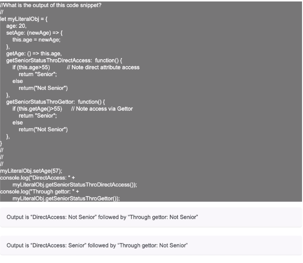

# Javascript General Knowledge Interview Questions

## 2019 [Streamlinity](https://streamlinity.com/stream-html/home/index.html) Javascript Assessment

> _I've attempted to keep the code formatting and question wording as close as possible to what I experienced taking the assessment. You will notice there is no syntax highlighting, helpful formatting, or even a uniform way of asking questions. These 'rough edges' are either there unintentionally or because the test taker is supposed to be good at reading poorly formatted code. Either way, the end result is that easy questions are made more difficult._

&nbsp;

### Q1: What will the code snippet below do?

```txt
<head>
<script>
document.addEventListener("DOMContentLoaded", function(event) {
  console.log(("Hello World"));
});
</script>
</head>
<body>
...
<h1>Hello!</h1>
</body>
</html>
```

#### Possible Choices

| ˙ | Choices | Answer |
|---|---------|:-------|
| A | It will never output "Hello World!" |
| **B** | It will output "Hello World!" when the web page is loaded, but before external resources like images are downloaded to the users's machine. | **`<--`** |
| C | It will output "Hello World!" concurrently as the browser displays the '\<h1>' tag  |  |
| D | It will output "Hello World!" when the user hits the Reload browser button | |

**Explanation:** [mdn,](https://developer.mozilla.org/en-US/docs/Web/API/Window/DOMContentLoaded_event) [javascript.info](https://javascript.info/onload-ondomcontentloaded)

&nbsp;

#### Q2: What is the output of this code snippet?

```txt
// What is the output of this code snippet?
//
// funcObject - object instantiation & this tests
//
let Circle = function(radius) {
  this.radius = radius;
  this.getArea = function() {
    return Math.PI*Math.pow(this.radius, 2);
  }
}
//
// Note: new in call
let myCircleNew = new Circle(5); // area - 78.5 for radius 5
console.log("myCircleNew... logs");
console.log(myCircleNew.getArea());
//
// Note: no new in call
// area - 314.16 for radius 10
let myCircleDirectCall = Circle(10);
console.log("myCircleDirectCall... logs");
console.log(myCircleDirectCall.getArea());
```

#### Possible Choices

| ˙ | Choices | Answer |
|---|---------|:-------|
|**A**| myCircleNew.getArea() returns 78.5; myCircleDirectCall.getArea() fails with error | **`<--`**  |
|B| myCircleNew call fails with error on new call; my CircleDirectCall.getArea() returns 314.16 |  |
|C| Both calls work fine. myCircleNew call returns 78.5, myCircleDirectCall returns 314.16 |  |
|D| Both myCircleNew.getArea() and myCircleDirectCall.getArea() fail with errors |  |

&nbsp;

### Q3: What is the outpout of this code snippet?

```txt
//What is the outpout of this code snippet?
function makeMultiplier(multiplier) {
  var myFunFunc = function (x) {
    return multiplier * x;
  };

  return myFunFunc;
}

var operation = makeMultiplier(10);
console.log(operation(10));
```

#### Possible Choices

| ˙ | Choices | Answer |
|---|---------|:-------|
|A| Undefined |  |
|B| 0 |  |
|**C**| 100 | **`<--`**  |
|D| 10 |  |

**Explanation:** The original function returns another function that knows what to multiply x by. This is a pretty standard js pattern.

&nbsp;

### Q4: What is the output of this code?

```txt
//What is the outpout of this code?
//
var counter = 0;
var myArray = ["Yaakov", 2, {handle: "yaakovchaikin"}];
for (var i = 0; i < myArray.length; i++){
  counter++;
}
console.log(counter);
```

#### Possible Choices

| ˙ | Choices | Answer |
|---|---------|:-------|
|**A**| 3 | **`<--`** |
|B| 0 |  |
|C| 4 |  |
|D| You will get an error |  |

**Explanation:** The loop executes its block 3 times before `i` is too big. The counter is updated from 0 to 1, then from 1 to 2, then from 2 to 3.

&nbsp;

### Q5: Given the HTML and the 2 code snippets, above what will be the difference in the output between the 2 Javascript code snippets?

```txt
<input id="name" type="text" value="Hi">

// Snippet 1

console.log(document.getElementById("name").value + " Hello world!");

// Snippet 2

console.log(document.querySelector("#name").value + " Hello world!");
// DOM manipulation: Given the HTML and the 2 code
// snippets, above what will be the difference in the output between 
// the 2 Javascript code snippets?
```

#### Possible Choices

| ˙ | Choices | Answer |
|---|---------|:-------|
|A| No difference | **`<--`**  |
|B| First one will throw a Javascript error |  |
|C| First one will not display the word 'Hi' |  |
|D| Second one will throw a Javascript error |  |

**Explanation:** [mdn query selector docs, ](https://developer.mozilla.org/en-US/docs/Web/API/Document/querySelector)

&nbsp;

### Q6: What (if anything) is missing from theis code in order to get it to output the message of the "dreamOn" method? Ignore line numbers - not part of code

```txt
// Immediately Invoked Function Execution: Given this code,
// What (if anything) is missing from this code in order to get
// it to outp9ut the message of the "dreamOn" method?
// Ignore line numbers - not part of code

1 (function(window){
2 
3 var obj = {};
4
5 obj.dreamOn = function (){
6  console.log("I am just fine. Let me out");
7 };
8
9 window.doer = obj;
10
11 });
12
13 doer.dreamOn();

```

#### Possible Choices

| ˙ | Choices | Answer |
|---|---------|:-------|
|A| Nothing is missing It will output "I am just fine. Let me out" |  |
|B| The attempted Immediately Invoked Function Execution (IIFE) is not being invoked and passed in the window object. It's missing '(window)' Line 11 right before the semicolon | **`<--`** |
|C| Line 1 and Line 9 should use 'global' instead of 'window' |  |
|D| The function definition in Line 5 is missing an argument. It should accept an argument by the name of 'window' |  |

**Explanation:** The 'IIFE' (not sure why we are using an acronym here, but okay, sure) is simply not invoked. Since it's not immediately invoked, it's more of an 'F' than an 'IIFE' - and more importantly, the `doer` function is never attached to the window. If the this code was being run on a server (like within a Node app) though, there would be no window object, but even run client-side, this doesn't work because the function is simply not being called. 

&nbsp;

### Q7: How many times is the string "Hello" printed?

```txt
// How many times is the string "Hello" printed?
//
var x = 10;
if ( (null) || (console.log("Hello")) || x > 5 ){
  console.log("Hello");
}
```

#### Possible Choices

| ˙ | Choices | Answer |
|---|---------|:-------|
|A| 3 |  |
|B| 1 |  |
|C| 5 |  |
|D| 2 | **`<--`** |
|E| 0 |  |

**Explanation:** Fairly straightforward, the gotcha is how the console.log happens within the boolean check.

&nbsp;

### Q8: What is the outpout of this code snippet?

```txt
//What is the outpout of this code snippet?
let myLiteralObj = {
  age: 20,
  setAge: (newAge) => {
    this.age = newAge;
  },
  getAge: () => this.age,
  getSeniorStatusThroDirectAccess: function() {
    if (this.age>55)    // Note direct attribute access
      return "Senior";
    else
      return("Not Senior")
  },
  getSeniorStatusThroGettor: function() {
    if (this.getAge()>55)   // Note access via Gettor
      return "Senior";
    else
      return("Not Senior")
  },
}
//
//
//
myLiteralObj.setAge(57);
console.log("DirectAccess: " + 
  myLiteralObj.getSeniorStatusThroDirectAccess());
console.log("Through gettor: " + 
  myLiteralObj.getSeniorStatusThroGettor());
```

#### Possible Choices

| ˙ | Choices | Answer |
|---|---------|:-------|
|A| Output is "DirectAccess: Not Senior" followed by "Through gettor: Not Senior | |
|B| Output is "DirectAccess: Senior" followed by "Through gettor: Not Senior | |
|C| Function errors out with "this" undefined |  |
|D| Output is "DirectAccess: Senior" followed by "Through gettor: Senior | |
|**E**| Output is "DirectAccess: Not Senior" followed by "Through gettor: Senior  | **`<--`** |

**Explanation:** The 'this' within the object literal's inner function is not the right 'this' when the method is eventually called

&nbsp;

----

### Actual Image Of Potato Quality Question 'Screen Shot'
